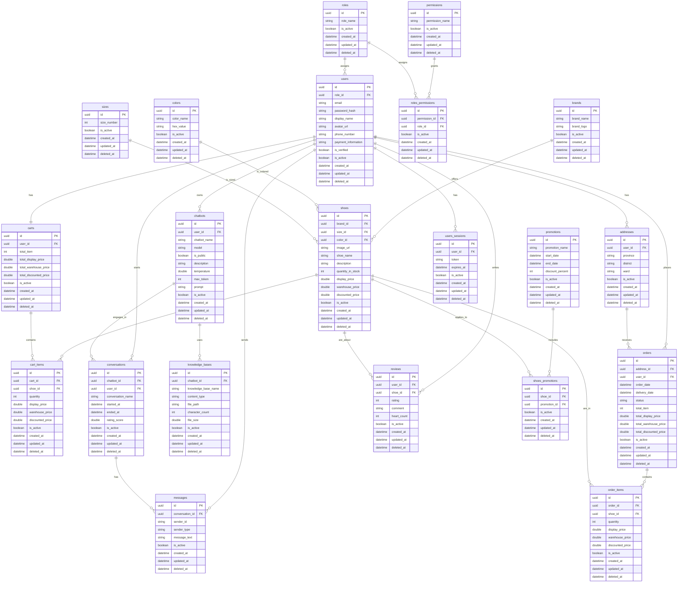

##### Entity Relationship Diagram (ERD) for the database schema of the project.

```mermaid
erDiagram
    users {
        uuid id PK
        uuid role_id FK
        string email
        string password_hash
        string display_name
        string avatar_url
        string phone_number
        string payment_information
        boolean is_verified
        boolean is_active
        datetime created_at
        datetime updated_at
        datetime deleted_at
    }

    addresses {
        uuid id PK
        uuid user_id FK
        string province
        string district
        string ward
        boolean is_active
        datetime created_at
        datetime updated_at
        datetime deleted_at
    }

    brands {
        uuid id PK
        string brand_name
        string brand_logo
        boolean is_active
        datetime created_at
        datetime updated_at
        datetime deleted_at
    }

    cart_items {
        uuid id PK
        uuid cart_id FK
        uuid shoe_id FK
        int quantity
        double display_price
        double warehouse_price
        double discounted_price
        boolean is_active
        datetime created_at
        datetime updated_at
        datetime deleted_at
    }

    carts {
        uuid id PK
        uuid user_id FK
        int total_item
        double total_display_price
        double total_warehouse_price
        double total_discounted_price
        boolean is_active
        datetime created_at
        datetime updated_at
        datetime deleted_at
    }

    chatbots {
        uuid id PK
        uuid user_id FK
        string chatbot_name
        string model
        boolean is_public
        string description
        double temperature
        int max_token
        string prompt
        boolean is_active
        datetime created_at
        datetime updated_at
        datetime deleted_at
    }

    colors {
        uuid id PK
        string color_name
        string hex_value
        boolean is_active
        datetime created_at
        datetime updated_at
        datetime deleted_at
    }

    conversations {
        uuid id PK
        uuid chatbot_id FK
        uuid user_id FK
        string conversation_name
        datetime started_at
        datetime ended_at
        double rating_score
        boolean is_active
        datetime created_at
        datetime updated_at
        datetime deleted_at
    }

    knowledge_bases {
        uuid id PK
        uuid chatbot_id FK
        string knowledge_base_name
        string content_type
        string file_path
        int character_count
        double file_size
        boolean is_active
        datetime created_at
        datetime updated_at
        datetime deleted_at
    }

    messages {
        uuid id PK
        uuid conversation_id FK
        string sender_id
        string sender_type
        string message_text
        boolean is_active
        datetime created_at
        datetime updated_at
        datetime deleted_at
    }

    order_items {
        uuid id PK
        uuid order_id FK
        uuid shoe_id FK
        int quantity
        double display_price
        double warehouse_price
        double discounted_price
        boolean is_active
        datetime created_at
        datetime updated_at
        datetime deleted_at
    }

    orders {
        uuid id PK
        uuid address_id FK
        uuid user_id FK
        datetime order_date
        datetime delivery_date
        string status
        int total_item
        double total_display_price
        double total_warehouse_price
        double total_discounted_price
        boolean is_active
        datetime created_at
        datetime updated_at
        datetime deleted_at
    }

    permissions {
        uuid id PK
        string permission_name
        boolean is_active
        datetime created_at
        datetime updated_at
        datetime deleted_at
    }

    promotions {
        uuid id PK
        string promotion_name
        datetime start_date
        datetime end_date
        int discount_percent
        boolean is_active
        datetime created_at
        datetime updated_at
        datetime deleted_at
    }

    reviews {
        uuid id PK
        uuid user_id FK
        uuid shoe_id FK
        int rating
        string comment
        int heart_count
        boolean is_active
        datetime created_at
        datetime updated_at
        datetime deleted_at
    }

    roles {
        uuid id PK
        string role_name
        boolean is_active
        datetime created_at
        datetime updated_at
        datetime deleted_at
    }

    roles_permissions {
        uuid id PK
        uuid permission_id FK
        uuid role_id FK
        boolean is_active
        datetime created_at
        datetime updated_at
        datetime deleted_at
    }

    shoes {
        uuid id PK
        uuid brand_id FK
        uuid size_id FK
        uuid color_id FK
        string image_url
        string shoe_name
        string description
        int quantity_in_stock
        double display_price
        double warehouse_price
        double discounted_price
        boolean is_active
        datetime created_at
        datetime updated_at
        datetime deleted_at
    }

    shoes_promotions {
        uuid id PK
        uuid shoe_id FK
        uuid promotion_id FK
        boolean is_active
        datetime created_at
        datetime updated_at
        datetime deleted_at
    }

    sizes {
        uuid id PK
        int size_number
        boolean is_active
        datetime created_at
        datetime updated_at
        datetime deleted_at
    }

    users_sessions {
        uuid id PK
        uuid user_id FK
        string token
        datetime expires_at
        boolean is_active
        datetime created_at
        datetime updated_at
        datetime deleted_at
    }

    users ||--o{ addresses : has
    users ||--|| carts : has
    users ||--o{ reviews : writes
    users ||--o{ chatbots : owns
    users ||--o{ conversations : starts
    users ||--o{ users_sessions : has
    users ||--o{ orders : places
    users ||--o{ messages : sends

    brands ||--o{ shoes : offers
    colors ||--o{ shoes : is_colored
    sizes ||--o{ shoes : is_sized
    permissions ||--o{ roles_permissions : grants
    roles ||--o{ users : assigns
    roles ||--o{ roles_permissions : assigns
    orders ||--o{ order_items : contains
    promotions ||--o{ shoes_promotions : includes
    shoes ||--o{ cart_items : are_in
    shoes ||--o{ order_items : are_in
    shoes ||--o{ reviews : are_about
    shoes ||--o{ shoes_promotions : applies_to
    carts ||--o{ cart_items : contains
    chatbots ||--o{ knowledge_bases : uses
    chatbots ||--o{ conversations : engages_in
    conversations ||--o{ messages : has
    addresses ||--o{ orders : receives

```
